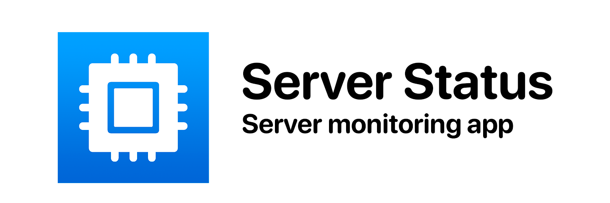

<h1 align="center">
  
</h1>
<h5 align="center">
  Server Status is a client for <a href="https://github.com/dani3l0/Status">Status</a>, a server monitoring tool. This application is created with SwiftUI for Apple devices.
</h5>

  

### Features
Server status allows you to monitor the status of your server hardware, in real time, and from the ease of your device. With Server Status you can monitor:
- CPU usage
- CPU temperature
- Memory usage
- Storage usage
- Network usage
- System information

The application also includes various home screen widgets, so you will can monitor your server easily from your home screen.

## Privacy policy
Check the privacy policy [here](https://pastebin.com/raw/n3gFhvWc).

 
 
 
 
 

##### Created by JGeek00